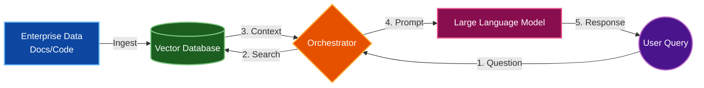
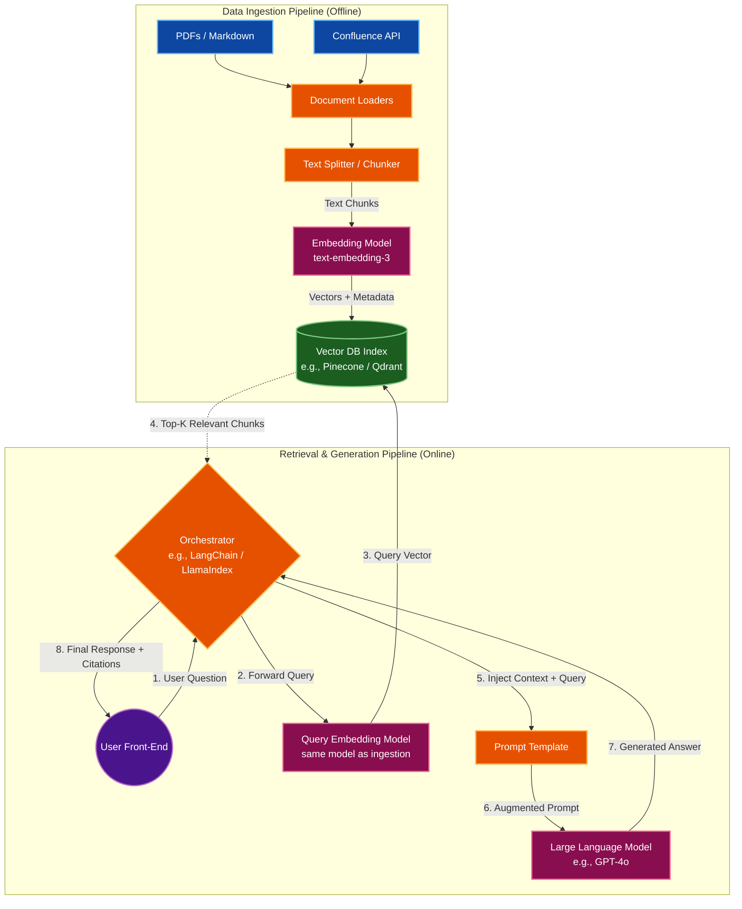

# Retrieval-Augmented Generation (RAG) Architecture
---

## 1. High-Level Architecture

---

## 2. Detailed Component Architecture

---

## 3. Explanation of Each Phase

A standard RAG workflow operates across three primary phases: **Data Ingestion**, **Retrieval**, and **Generation**.

### Phase 1: Data Ingestion (Indexing)
This offline process prepares and structures organizational data for rapid search.
* **Extraction:** Raw text is systematically gathered from enterprise sources (e.g., Confluence, Jira, PDFs, and code repositories).
* **Chunking:** Documents are segmented into smaller, manageable text blocks to optimize processing. An overlap between chunks is maintained to preserve semantic continuity.
* **Embedding:** An embedding model converts each text block into a mathematical vector representation, capturing its underlying meaning.
* **Storage:** The generated vectors, along with their corresponding text and source metadata, are stored in a Vector Database for highly efficient similarity searches.

### Phase 2: Retrieval
This process locates the most relevant information based on the user's prompt.
* **Query Vectorization:** The user's query is processed through the identical embedding model to generate a query vector.
* **Semantic Search:** The orchestrator queries the Vector Database, computing the mathematical proximity between the query vector and the stored document vectors.
* **Context Extraction:** The database returns the top-ranked (Top-K) document chunks that possess the highest semantic relevance to the query.

### Phase 3: Generation (Augmentation)
This final phase formulates a comprehensive answer using the retrieved facts.
* **Prompt Construction:** The orchestrator integrates the retrieved document chunks and the original user query into a structured Prompt Template.
* **LLM Synthesis:** The Large Language Model analyzes the augmented prompt. Guided by the provided factual context, it generates an accurate, domain-specific response, significantly mitigating the risk of hallucination.
* **Response Delivery:** The synthesized answer is presented to the user, frequently accompanied by citations referencing the original source documents.

