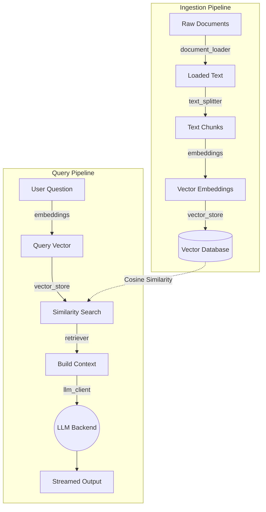

# RAG Bot — Retrieval-Augmented Generation Chatbot

A RAG-based chatbot built **from scratch** without LangChain or LlamaIndex. It retrieves relevant information from a knowledge base and generates grounded answers using LLMs.

---

## Architecture



---

## Project Structure

```
Task4/
├── app.py                     # Streamlit web UI (entry point)
├── ingest.py                  # CLI script to build the vector index
├── requirements.txt
├── .env                       # API keys (not committed)
├── .env.example               # Template for .env
├── data/                      # Knowledge base documents (.md, .txt, .pdf)
├── index/                     # Auto-generated vector index
└── rag/                       # Core RAG module
    ├── config.py              # Settings and environment variables
    ├── document_loader.py     # Load .md, .txt, .pdf files
    ├── text_splitter.py       # Split documents into overlapping chunks
    ├── embeddings.py          # Convert text → numerical vectors
    ├── vector_store.py        # Custom numpy-based vector database
    ├── retriever.py           # Semantic search with score threshold
    ├── llm_client.py          # Multi-backend LLM streaming (Groq/Azure/Claude/Ollama)
    └── engine.py              # RAG orchestrator (ties everything together)
```

---

## How It Works

### Ingestion Pipeline

1. **Load** — Reads all `.md`, `.txt`, `.pdf` files from `data/` directory
2. **Split** — Breaks documents into ~800-character chunks with 100-char overlap so nothing is lost at boundaries
3. **Embed** — Converts each chunk into a 384-dimension numerical vector that captures its meaning
4. **Store** — Saves vectors to `index/embeddings.npy` and text to `index/chunks.json`

### Query Pipeline

1. **Embed Query** — Converts the user's question into a vector using the same model
2. **Search** — Compares the query vector against all stored vectors using cosine similarity, returns the top 3 most relevant chunks
3. **Filter** — Drops results with similarity score below 0.3 (filters out noise for casual messages like "hello")
4. **Build Context** — Formats retrieved chunks into numbered text with source attribution
5. **Generate** — Sends system prompt + context + chat history + question to the LLM, streams the response token-by-token

---

## Module Details

### `app.py` — Streamlit UI
- Chat interface with message history
- Sidebar: LLM/Embedding backend selectors, parameter sliders, file upload
- Clear Chat button resets both messages and uploaded session documents

### `rag/engine.py` — Orchestrator
- `RAGEngine` class with `query()` and `ingest_document()` methods
- Manages two stores: **base** (permanent docs) and **session** (uploaded mid-chat)
- System prompt instructs the LLM to answer only from provided context

### `rag/document_loader.py` — File Reading
- `load_documents()` — Scans a directory and loads all supported files
- `load_from_bytes()` — Loads a single file from raw bytes (for uploads)
- PDF extraction via PyMuPDF (fitz)

### `rag/text_splitter.py` — Chunking
- Normalizes whitespace, splits into sentences, packs into chunks
- Handles oversized sentences with hard character-limit splitting
- Overlap ensures context isn't lost at chunk boundaries

### `rag/embeddings.py` — Embedding Generation
- `generate_embeddings()` — Routes to the configured backend
- Backends: **Local** (`all-MiniLM-L6-v2`), **Ollama** (`nomic-embed-text`), **Azure** (`text-embedding-3-small`)

### `rag/vector_store.py` — Custom Vector Database
- Built with numpy — no external database needed
- `similarity_search()` — Cosine similarity via matrix multiplication
- `persist()` / `load_from_disk()` — Save/load index to `.npy` + `.json` files
- All vectors are L2-normalized for accurate cosine similarity

### `rag/retriever.py` — Search + Context
- `retrieve()` — Embeds the query, searches the store, filters by score threshold
- `build_context()` — Formats results into numbered text with source names

### `rag/llm_client.py` — LLM Streaming
- `stream_completion()` — Routes to the configured LLM backend
- All backends stream responses token-by-token
- Claude handler extracts system prompt separately (API requirement)

### `rag/config.py` — Settings
- Dataclass with environment variable defaults
- All settings configurable via `.env` file or Streamlit sidebar

---

## Supported Backends

| LLM Backend | Type | Model | API Key Required |
|-------------|------|-------|-----------------|
| Groq | Cloud | `llama-3.3-70b-versatile` | Yes |
| Azure OpenAI | Cloud | `gpt-4o` | Yes |
| Claude | Cloud | `claude-sonnet-4-5` | Yes |
| Ollama | Local | `llama3.2` | No |

| Embedding Backend | Type | Model | API Key Required |
|-------------------|------|-------|-----------------|
| Local | CPU | `all-MiniLM-L6-v2` | No |
| Ollama | Local | `nomic-embed-text` | No |
| Azure | Cloud | `text-embedding-3-small` | Yes |

---

## Setup & Run

```bash
# 1. Create and activate virtual environment
python -m venv venv
source venv/bin/activate

# 2. Install dependencies
pip install -r requirements.txt

# 3. Configure environment
cp .env.example .env
# Edit .env and add your API keys

# 4. Build the vector index
python ingest.py

# 5. Run the app
streamlit run app.py
```

App will be available at `http://localhost:8501`

---

## Key Design Decisions

- **No LangChain/LlamaIndex** — Built from scratch to demonstrate RAG internals
- **Numpy vector store** — Simple, fast, zero database dependencies
- **Multi-backend support** — Switch between cloud and local providers without code changes
- **Streaming responses** — Real-time token-by-token display
- **Score threshold** — Filters irrelevant results for casual messages
- **Chunk overlap** — Prevents information loss at chunk boundaries
- **Dual store (base + session)** — Upload documents mid-conversation without rebuilding the full index
